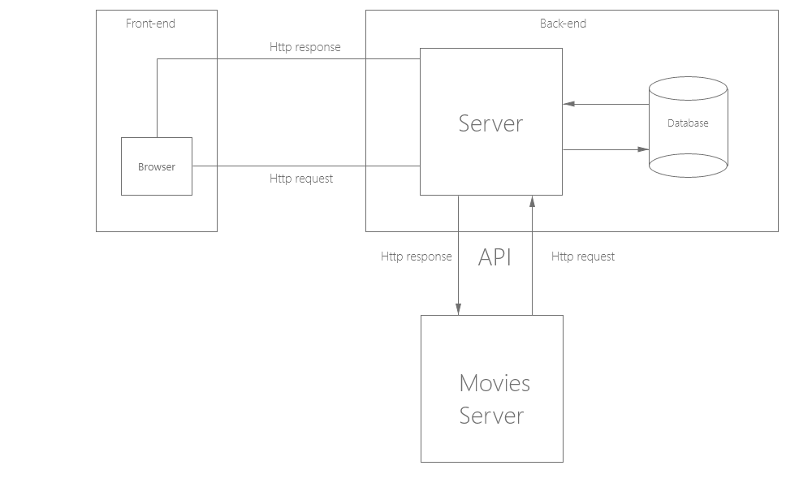

# Movies-Library - 1.0

**Author Name**: Hamzh freijat

##WRRC using API

## Overview
Introduction to node server using express.js framework 
## Getting Started
Build your first node server using the following command : 
- `npm init -y `
- `npm install express cors` 
- Then follow the code in server.js file

## Project Features
- Build node server from scratch using express framework .
- Use some route in code like get method request route. 
